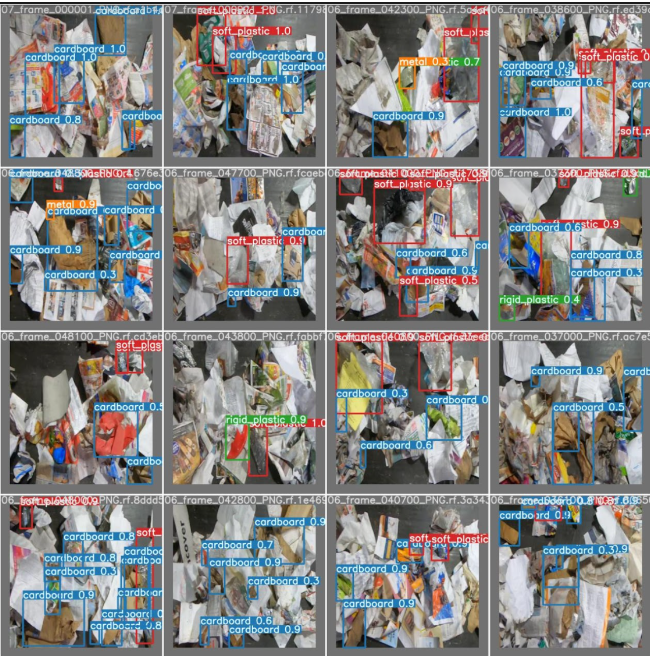

# EC523_DL_CV_Project

## Index
- [Project Overview](#project-overview)
- [Implementation Plan](#implementation-plan)
- [Project Structure](#project-structure)
- [Resources](#resources)
- [Taining Instructions](#how-to-train-the-models)
- [Environment Setup](#setting-up-environment)

## Project Overview
In recent years, environmental management problems has received increasing attention from the public. One of the key problems people are trying to solve is the ability to efficiently identify
different types of waste materials during the waste recycling process. Automatic waste detection becomes a necessity when tons of waste materials have to be processed at the waste recycle center every day. Our project aims to utilize deep learning and computer vision techniques to efficiently and accurately detect different waste materials.

## Implementation Plan
In the first half of our project, we tried to test out different one-stage detection models and two-stage detection models. For YOLOv4 and YOLOR, we adapted the original PyTorch implementations by WongkinYiu. For Dynamic R-CNN, we used the MMdetection toolbox. For the second half of our project, we focused on exploring different techniques that can optimize and improve the performance of the models mentioned above. We planned to implement an UI to showcase the detection capability of one of the models, but due to time constraints, we did not finish this part. If you would like to know more about our project, please check out our final report here.  

__Dataset__: The dataset we are using to train and test our models is the ZeroWaste dataset proposed by Bashkirova et al. Check out their paper [here](https://arxiv.org/abs/2106.02740). Since the dataset takes a lot of space, we did not include the dataset in our repo. You can download the ZeroWaste dataset [here](https://zenodo.org/record/6412647#.YnSTWhOZNhE). The YOLOv4 and YOLOR model were trained on a further processed version of the ZeroWaste dataset, so you have to run the `download_data.py` located in `roboflow-ai/` or `YOLOv4/scripts` to download the appropriate data for YOLOv4 and YOLOR.  
__Models to Compare__: 
  - YOLOv4 (original version [here](https://github.com/WongKinYiu/PyTorch_YOLOv4), our modified version is in the `YOLOv4` directory)
  - Scaled YOLOv4 (original version [here](https://github.com/WongKinYiu/ScaledYOLOv4), currently not tested due to time constraints)
  - YOLOR (original version [here](https://github.com/WongKinYiu/yolor), our modified version is in the `roboflow-ai/yolor` directory)
  - Dynamic R-CNN (MMdetection implementation [here](https://github.com/open-mmlab/mmdetection), our modified version is the the `mmdetection` directory)

## Project Structure
Our project will be structured as follows:
```
.
├── Archives/
├── images/
├── mmdetection/
├── notebooks/
│   ├── Training_YOLOR_on_a_zerowaste.ipynb
│   ├── waste_detection_D-RCNN.ipynb
│   └── waste_detection_yolov4.ipynb
├── Papers/
├── reports/
├── roboflow-ai/
│   ├── ...
│   └── yolor/
├── web/
├── YOLOv4/
├── LICENSE
├── README.md
└── Resources.md
```

## Resources
We have put together a collection of resources for further learning and exploration in related topics in this [file](./Resources.md)

## How to Train the Models
Before learning how to train the models, please check out the [Environment Setup](#setting-up-environment) section below on how to use BU SCC.  
We have written some notebooks on how to train the selected YOLO, YOLOR, and Dynamic R-CNN models. These notebooks contain detailed instructions on how to train the above models on the ZeroWaste dataset. The notebooks can be found in the `src/notebooks` directory. 

## Setting up Environment:
<details open>
<summary> expand to see how to set up environment </summary>
- Requirement Packages:
  - numpy, Theano, Torch
- Running in Local:

```bash
# General installation
# A1: Setting up your development environment manually
conda create -n latst_tf python=3
conda activate latst_tf
conda install numpy pandas matplotlib  jupyter notebook
conda install -c conda-forge opencv
conda install pytorch torchvision -c pytorch
pip install Theano keras tensorflow

# A2: Using the conda environment from other's repo
cd installer
conda env create -f my_environment.yaml
# Launch your Jupyter notebook (make sure you are located in the root of the
jupyter notebook	
deep_learning_for_vision_systems repository):

# A3: Saving and loading environment
# save your environment to a YAML file
conda env export > my_environment.yaml
# For other's who want to replicate your environment on their machine
conda env create -f my_environment.yaml	
# You can also use Pip to export the list of packages in an environment to a .txt file, and then include that file with your code. This allows other people to easily load all the dependencies for you code with pip
pip freeze > requirements.txt	

# With CUDA support --> Find out yourself, since it's version and compiler specific
```

- Running in Cloud Platform:
- **With BU SCC**
    - Some useful resources:
        - Login Tutorial, http://rcs.bu.edu/classes/CS542/SC542.html
        - With [X server](https://vlaams-supercomputing-centrum-vscdocumentation.readthedocs-hosted.com/en/latest/access/using_the_xming_x_server_to_display_graphical_programs.html#:~:text=Running%20Xming%3A,programs%20(such%20as%20PuTTY).)
        - Installing package with Conda, https://www.bu.edu/tech/support/research/software-and-programming/common-languages/python/anaconda/#exp2
        - [SCC Quick Start Guide](https://www.bu.edu/tech/support/research/system-usage/scc-quickstart/)
    - Routine setting up command:
        ```bash
        # Get a computing node
        qrsh -P dl523 -l gpus=1 -l gpu_c=3.5

        # Setting up deep learning env (DON't CHANGE THE ORDER)
        module load python3/3.8.10
        module load tensorflow/2.5.0
        module load pytorch/1.9.0
        module load opencv/4.5.0	
        module load cuda/11.1
        module load pandoc/2.5
        module load texlive/2018
        # module load miniconda/4.9.2

        # If you don't have miniconda, run the following code
        # curl -O https://repo.anaconda.com/miniconda/Miniconda3-latest-Linux-x86_64.sh
        # sh Miniconda3-latest-Linux-x86_64.sh

        source ~/miniconda3/bin/activate
        export PYTHONNOUSERSITE=true
        conda activate dl_env
        which python
        # conda activate tf_latest
        # module list
        # If you haven't setting up a conda env yet:
        # conda create -n py3 python==3.8.10 numpy scipy matplotlib ipykernel

        # Verify Pytorch and Tensorflow has CUDA support:
        $ python
        [[APython 3.8.10 (default, Jun  4 2021, 15:09:15) 
        [GCC 7.5.0] :: Anaconda, Inc. on linux
        Type "help", "copyright", "credits" or "license" for more information.
        >>> import torch
        >>> import tensorflow as tf
        >>> torch.cuda.is_available()
        True
        >>> tf.test.gpu_device_name()
        '/device:GPU:0'
        >>> exit()
        ```
    - Submitting Python Jupyter Notebook as a job on the SCC (optional)
        ```bash
        module load python3/3.7.7
        module load pandoc/2.5git
        module load texlive/2018
        jupyter nbconvert --to notebook --execute hw5.ipynb
        jupyter nbconvert hw5.nbconvert.ipynb --to pdf

        # Or if you want to save it into HTML format then:
        module load python3/3.7.7
        jupyter nbconvert --execute hw5.ipynb
        ```

  - Google Colab
  - AWS Tutorial, https://cs231n.github.io/aws-tutorial/
    - Basicallly, EC2 --> AMI (with  AMI ID: `ami-125b2c72`, `g2.2xlarge` instance) --> `chmod 600 PEM_FILENAME`  --> `ssh -L localhost:8888:localhost:8888 -i your_name.pem ubuntu@your_instance_DNS`
      - TIP: If you see a “bad permissions” or “permission denied” error message regarding your .pem file, try executing `chmod 400 path/to/YourKeyName.pem` and then running the ssh command again.
    - Run Jupyter Notebook on the EC2 server:
    
    ```bash
    # Type the following command on your terminal:
    jupyter notebook --ip=0.0.0.0 --no-browser
    ```

  When you press Enter, you will get an access token, as shown in figure A.3. Copy this token value, because you will use it in the next step.


  On your browser, go to this URL: http://:8888. Note that the IPv4 public IP is the one you saved from the EC2 instance description. For example, if the public IP was 25.153.17.47, then the URL would be http:// 25.153.17.47:8888.

  Enter the token key that you copied in step 1 into the token field, and click Log In (figure A.4).


</details>

## Final Result
Overall, we've achived really nice results in all the models we chose to compare in our project. The following table shows the best result produced by each model. The results for RetinaNet, Mask R-CNN, and TridentNet were given in the [ZeroWaste](https://arxiv.org/abs/2106.02740) paper.  

|Models|AP|AP50|AP75|APs|APm|APl|
|:----:|:----:|:----:|:----:|:----:|:----:|:----:|
|RetinaNet|21.0|33.5|22.2|4.3|9.5|22.7|
|Mask R-CNN|22.8|34.9|24.4|4.6|10.6|25.8|
|TridentNet|24.2|36.3|26.6|4.8|10.7|26.1|
|Dynamic R-CNN|30.8|42.6|33.5|4.9|14.6|33.7|
|YOLOv4|39.1|52.9|43.2|12.9|25.5|46.7|
|YOLOR|62.1|74.2|67.7|28.4|48.0|69.9|

The detections on the dataset looks like this:



For more detailed results, please refer to our final report here.


## Appendix A:

Batch script template for running in SCC:
```batch
#!/bin/bash -l

# Set SCC project
#$ -P dl523

# Specify hard time limit for the job. 
#   The job will be aborted if it runs longer than this time.
#   The default time is 12 hours
#$ -l h_rt=24:00:00

# Request 4 CPUs
#$ -pe omp 2

# Request 1 GPU 
#$ -l gpus=1

# Specify the minimum GPU compute capability 
#$ -l gpu_c=7

# specify gpu type
#$ -l gpu_type=V100

# specify minimum gpu memory
#$ -l gpu_memory=16G

# Send an email when the job finishes or if it is aborted (by default no email is sent), or begin
#$ -m eab

# Give job a name
#$ -N scaled_yolov4_p7_zerowaste_v16_640x640_300

# Combine output and error files into a single file
#$ -j y

# Specify the output file name
#$ -o /projectnb/dl523/projects/RWD/EC523_DL_CV_Project/roboflow-ai/log/scaled_yolov4_p7_zerowaste_v16_640x640_300_05-05-2022.qlog

# ==========> Read more about batch script files arguments, https://www.bu.edu/tech/support/research/system-usage/running-jobs/submitting-jobs/

# Keep track of information related to the current job
echo "=========================================================="
echo "Start date : $(date)"
echo "Job name : $JOB_NAME"
echo "Job ID : $JOB_ID  $SGE_TASK_ID"
echo "=========================================================="
echo "==========================> Loading moudule for Project Environment"
# qrsh -P dl523 -l gpus=1 -l gpu_c=3.5
# qsub run_batch.sh
module load python3/3.8.10
# module load tensorflow/2.5.0
# module load pytorch/1.9.0
# module load opencv/4.5.0
module load cuda/11.3
# module load pandoc/2.5
# module load texlive/2018
# module load miniconda/4.9.2
# module load gcc/9.3.0
export PATH=/usr4/dl523/dong760/.local/lib/python3.8/site-packages:$PATH
export PATH=/usr4/dl523/dong760/.conda/envs/dl_env/bin:$PATH
source /projectnb/dl523/students/dong760/miniconda3/bin/activate
export PYTHONNOUSERSITE=true
conda activate dl_env

echo "===========================> Checking OS Information"
lsb_release -a
uname -m && cat /etc/*release
echo "===========================> Checking CPU Information"
lscpu
# Check you have GPU driver installed
echo "===========================> Checking GPU Configuration"
nvidia-smi
# nvidia-htop.py --color -l 30	# Read here to learn more about GPU monitoring, https://github.com/peci1/nvidia-htop
# Checking you have CUDA compiler
nvcc --version	
uname -arv

echo "==========================> Checking SCC Quota Usage"
pquota dl523
quota -s
qstat -u [buid]
module list

echo "==========================> Current ENV Path"
echo $PATH
echo ""
echo $PYTHONPATH
python -V
which python


echo "==========================> Start Training"
LOGFILE="./log"
TIMESTAMP=`date "+%Y_%m_%d-%H_%M_%S"`
PROJECT_NAME="scaled_yolov4_p7_zerowaste_v16_640x640_300"
SCC_GROUP='dl523'
echo $PROJECT_NAME\_$TIMESTAMP
DATASET_DIR='../zero-waste-10'
cd /projectnb/dl523/projects/RWD/EC523_DL_CV_Project/roboflow-ai/yolor

# If you want to do the distributed training
python -m torch.distributed.launch --nproc_per_node 4 --master_port 9527 train.py --batch-size 16 --img 640 640 --data $DATASET_DIR/data.yaml --cfg cfg/yolov4_p7.cfg --weights '' --name yolov4_p6_$TIMESTAMP --hyp data/hyp.scratch.640.yaml --epochs 300 --augment True --sync-bn --device 0,1,2,3 --exist-ok
# or --weights weights/yolov4_p6.weights

# python train.py --batch-size 16 --img 640 640 --data $DATASET_DIR/data.yaml --cfg cfg/yolov4_p6.cfg --weights weights/yolov4_p6.weights --name yolov4_p6_$TIMESTAMP --hyp data/hyp.scratch.640.yaml --epochs 300 --augment True  --device 0

python test.py --conf-thres 0.0 --img 640 --batch 16 --device 0 --data $DATASET_DIR/data.yaml --cfg cfg/yolov4_p6.cfg --weights runs/train/yolov4_p6_$TIMESTAMP/weights/best_overall.pt --task test --names data/zerowaste.names --verbose --save-json --save-conf --save-txt --gt_json_dir $DATASET_DIR/test/_annotations.coco.json

# More argument refers to https://github.com/WongKinYiu/ScaledYOLOv4

############# (Upon completed) Managing and Tracking your Batch Job, https://www.bu.edu/tech/support/research/system-usage/running-jobs/tracking-jobs/
date
qstat -u [buid]

```
