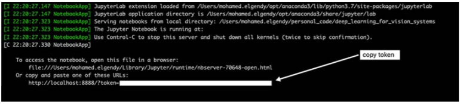

# EC523_DL_CV_Project


- **Object detection:**
    - Keywords
        - Yolo, Object Detection
    - Importance:
    - Possible Dataset
        - ZeroWaste Detection [[Code](https://github.com/dbash/zerowaste/)] [[Paper](https://arxiv.org/abs/2106.02740)] [[Dataset](http://ai.bu.edu/zerowaste/#overview)]
        - datasets [38, 48, 54, 60]
    - Approaches/Methodologies Description:
        - Lecture Collection | Convolutional Neural Networks for Visual Recognition (Spring 2017)， Understanind CNN, [Lecture Collection | Convolutional Neural Networks](https://www.youtube.com/playlist?list=PL3FW7Lu3i5JvHM8ljYj-zLfQRF3EO8sYv)
        - Deep Learning for Computer Vision, https://www.youtube.com/playlist?list=PL5-TkQAfAZFbzxjBHtzdVCWE0Zbhomg7r
    - Implementation:
        - !!! [Drone Programming With Python Course](https://www.youtube.com/watch?v=LmEcyQnfpDA) | 3 Hours | Including x4 Projects | Computer Vision
        - OpenCv Samples, C:\Users\59384\opencv-4.5.5\opencv\samples\python --> Can be used for testing OpenCV installation as well
        - What’s new in YOLO v3?, https://towardsdatascience.com/yolo-v3-object-detection-53fb7d3bfe6b
        - How to implement a YOLO (v3) object detector from scratch in PyTorch: Part 1, https://blog.paperspace.com/how-to-implement-a-yolo-object-detector-in-pytorch/
        - Deep Learning for Vision System, https://github.com/moelgendy/deep_learning_for_vision_systems
        - ageron/-ml, https://github.com/ageron/handson-ml
        - Top-down learning path: Machine Learning for Software Engineers, https://github.com/ZuzooVn/machine-learning-for-software-engineers
        - Awesome Computer Vision: https://github.com/jbhuang0604/awesome-computer-vision
        - Top Deep Learning Projects, A list of popular github projects related to deep learning (ranked by stars), https://github.com/aymericdamien/TopDeepLearning
        - Practical-Deep-Learning-Book, https://github.com/PracticalDL/Practical-Deep-Learning-Book
        - Learn_Computer_Vision, the curriculum for "Learn Computer Vision" by Siraj Raval on Youtube, https://github.com/llSourcell/Learn_Computer_Vision
        - Computer Vision Nanodegree Program, Exercises, code exercises and materials for Udacity's [Computer Vision Nanodegree](https://www.udacity.com/course/computer-vision-nanodegree--nd891) program, https://github.com/udacity/CVND_Exercises
            - YOLO.ipynb, https://github.com/Boston-University-Projects/CVND_Exercises/blob/master/2_2_YOLO/YOLO.ipynb
        - computer_vision_tutorial, An intro to computer vision course created for Amazon's machine learning university, https://github.com/moelgendy/computer_vision_tutorial
    - Concept from Paper:
        - 论文总结 | CVPR2021目标检测论文大盘点（65篇优秀论文）, https://mp.weixin.qq.com/s/0KdShy9whUQEyPMzEFpswg
        - 目标检测算法-YOLOv4 详解, https://mp.weixin.qq.com/s/_tjUbwG2PahLO9JSt3Nl_w
        - https://mp.weixin.qq.com/mp/homepage?__biz=MzI1MzUwMzMwOQ==&hid=6&sn=f7777da8d0800f2dcc2148b99c55ecd0&scene=1&devicetype=iOS15.2.1&version=1800112c&lang=en&nettype=WIFI&ascene=0&fontScale=100&wx_header=3

## Setting up Environment:

- Requirement Packages:
  - numpy, Theano, Torch
- Running in Local:

```bash
# General installation
# A1: Setting up your development environment manually
conda create -n latst_tf python=3
conda activate latst_tf
conda install numpy pandas matplotlib  jupyter notebook
conda install -c conda-forge opencv
conda install pytorch torchvision -c pytorch
pip install Theano keras tensorflow

# A2: Using the conda environment from other's repo
cd installer
conda env create -f my_environment.yaml
# Launch your Jupyter notebook (make sure you are located in the root of the
jupyter notebook	
deep_learning_for_vision_systems repository):

# A3: Saving and loading environment
# save your environment to a YAML file
conda env export > my_environment.yaml
# For other's who want to replicate your environment on their machine
conda env create -f my_environment.yaml	
# You can also use Pip to export the list of packages in an environment to a .txt file, and then include that file with your code. This allows other people to easily load all the dependencies for you code with pip
pip freeze > requirements.txt	

# With CUDA support --> Find out yourself, since it's version and compiler specific
```

- Running in Cloud Platform:
- **With BU SCC**
    - Some useful resources:
        - Login Tutorial, http://rcs.bu.edu/classes/CS542/SC542.html
        - With [X server](https://vlaams-supercomputing-centrum-vscdocumentation.readthedocs-hosted.com/en/latest/access/using_the_xming_x_server_to_display_graphical_programs.html#:~:text=Running%20Xming%3A,programs%20(such%20as%20PuTTY).)
        - Installing package with Conda, https://www.bu.edu/tech/support/research/software-and-programming/common-languages/python/anaconda/#exp2
        - [SCC Quick Start Guide](https://www.bu.edu/tech/support/research/system-usage/scc-quickstart/)
    - Routine setting up command:
        ```bash
        # Get a computing node
        qrsh -P dl523 -l gpus=1 -l gpu_c=3.5

        # Setting up deep learning env (DON't CHANGE THE ORDER)
        module load python3/3.8.10
        module load tensorflow/2.5.0
        module load pytorch/1.9.0
        module load opencv/4.5.0	
        module load cuda/11.1
        module load pandoc/2.5
        module load texlive/2018
        # module load miniconda/4.9.2

        # If you don't have miniconda, run the following code
        # curl -O https://repo.anaconda.com/miniconda/Miniconda3-latest-Linux-x86_64.sh
        # sh Miniconda3-latest-Linux-x86_64.sh

        source ~/miniconda3/bin/activate
        export PYTHONNOUSERSITE=true
        conda activate dl_env
        which python
        # conda activate tf_latest
        # module list
        # If you haven't setting up a conda env yet:
        # conda create -n py3 python==3.8.10 numpy scipy matplotlib ipykernel

        # Verify Pytorch and Tensorflow has CUDA support:
        $ python
        [[APython 3.8.10 (default, Jun  4 2021, 15:09:15) 
        [GCC 7.5.0] :: Anaconda, Inc. on linux
        Type "help", "copyright", "credits" or "license" for more information.
        >>> import torch
        >>> import tensorflow as tf
        >>> torch.cuda.is_available()
        True
        >>> tf.test.gpu_device_name()
        '/device:GPU:0'
        >>> exit()
        ```
    - Submitting Python Jupyter Notebook as a job on the SCC (optional)
        ```bash
        module load python3/3.7.7
        module load pandoc/2.5git
        module load texlive/2018
        jupyter nbconvert --to notebook --execute hw5.ipynb
        jupyter nbconvert hw5.nbconvert.ipynb --to pdf

        # Or if you want to save it into HTML format then:
        module load python3/3.7.7
        jupyter nbconvert --execute hw5.ipynb
        ```

  - Google Colab
  - AWS Tutorial, https://cs231n.github.io/aws-tutorial/
    - Basicallly, EC2 --> AMI (with  AMI ID: `ami-125b2c72`, `g2.2xlarge` instance) --> `chmod 600 PEM_FILENAME`  --> `ssh -L localhost:8888:localhost:8888 -i your_name.pem ubuntu@your_instance_DNS`
      - TIP: If you see a “bad permissions” or “permission denied” error message regarding your .pem file, try executing `chmod 400 path/to/YourKeyName.pem` and then running the ssh command again.
    - Run Jupyter Notebook on the EC2 server:
    
    ```bash
    # Type the following command on your terminal:
    jupyter notebook --ip=0.0.0.0 --no-browser
    ```

  When you press Enter, you will get an access token, as shown in figure A.3. Copy this token value, because you will use it in the next step.



  On your browser, go to this URL: http://:8888. Note that the IPv4 public IP is the one you saved from the EC2 instance description. For example, if the public IP was 25.153.17.47, then the URL would be http:// 25.153.17.47:8888.

  Enter the token key that you copied in step 1 into the token field, and click Log In (figure A.4).


